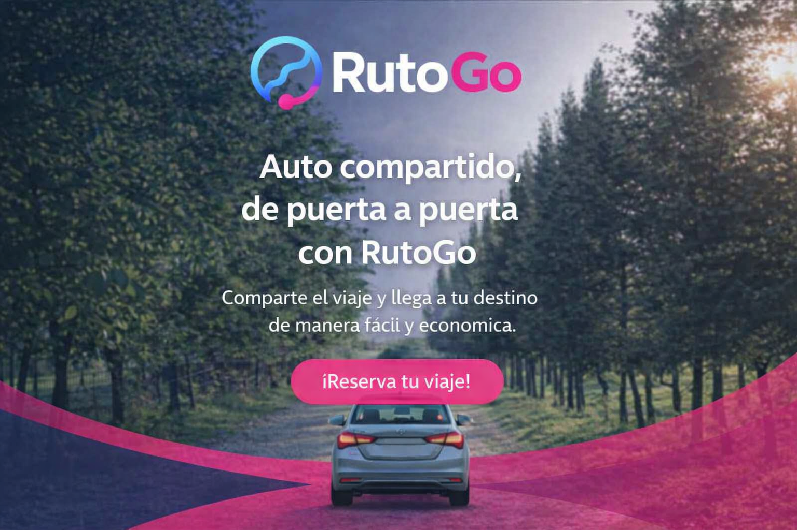

# 🚗 RutoGo — Plataforma de Viajes Compartidos

Plataforma de carpooling para Colombia, construida con **Angular 18** + **Angular Material**.

---

<p align="center">
  
</p>

## 🚀 Inicio rápido

### Requisitos previos
- Node.js 18+ → https://nodejs.org
- Angular CLI 18+ (instalarlo globalmente)

```bash
npm install -g @angular/cli@18
```

### Instalación

```bash
# 1. Instalar dependencias
npm install

# 2. Levantar servidor de desarrollo
ng serve

# 3. Abrir en el navegador
# http://localhost:4200
```

---

## 🏗️ Arquitectura del proyecto

```
src/
├── app/
│   ├── core/                    ← Lógica global (singleton)
│   │   ├── guards/
│   │   │   └── auth.guard.ts    ← Protege rutas privadas
│   │   ├── interceptors/
│   │   │   └── auth.interceptor.ts  ← Inyecta JWT en cada request
│   │   ├── models/
│   │   │   └── trip.model.ts    ← Interfaces TypeScript
│   │   └── services/
│   │       ├── auth.service.ts  ← Auth con Signals
│   │       └── trip.service.ts  ← Datos de viajes (mock → API)
│   │
│   ├── shared/                  ← Componentes reutilizables
│   │   └── components/
│   │       ├── navbar/
│   │       └── footer/
│   │
│   ├── features/                ← Módulos por funcionalidad (lazy)
│   │   ├── landing/             ← Landing page (secciones separadas)
│   │   │   └── components/
│   │   │       ├── hero/
│   │   │       ├── stats/
│   │   │       ├── benefits/
│   │   │       ├── trips/
│   │   │       ├── how-it-works/
│   │   │       └── cta/
│   │   ├── auth/
│   │   │   ├── login/
│   │   │   └── register/
│   │   ├── trips/               ← Búsqueda de viajes
│   │   └── dashboard/           ← Panel de usuario (protegido)
│   │
│   ├── app.component.ts
│   ├── app.config.ts            ← Providers globales
│   └── app.routes.ts            ← Routing con lazy loading
│
├── environments/
│   ├── environment.ts           ← Dev (apunta a localhost)
│   └── environment.prod.ts      ← Prod
└── styles.scss                  ← Design tokens globales
```

---

## 🎨 Design Tokens (CSS Variables)

| Variable             | Valor          | Uso                     |
|----------------------|----------------|-------------------------|
| `--rg-orange`        | `#f7a427`      | Acento primario         |
| `--rg-pink`          | `#f03e6e`      | Acento secundario / CTA |
| `--rg-navy`          | `#1a2d5a`      | Color base / textos     |
| `--rg-gradient`      | orange → pink  | Botones y avatares      |
| `--rg-font-head`     | Nunito 900     | Títulos y display       |
| `--rg-font-body`     | Nunito Sans    | Cuerpo de texto         |

---

## 🔑 Rutas

| Ruta               | Componente    | Protegida |
|--------------------|---------------|-----------|
| `/`                | Landing       | No        |
| `/viajes`          | Trips         | No        |
| `/auth/login`      | Login         | No        |
| `/auth/register`   | Register      | No        |
| `/dashboard`       | Dashboard     | ✅ Sí     |

---

## 🔌 Conectar con tu API

Los servicios usan datos mock. Para conectar con tu backend:

1. Cambia la URL en `src/environments/environment.ts`
2. En `auth.service.ts` → los métodos `login()` y `register()` ya usan `HttpClient`
3. En `trip.service.ts` → reemplaza `of(MOCK_TRIPS)` por llamadas HTTP reales

---

## 📦 Build para producción

```bash
ng build --configuration production
```

Los archivos quedan en `dist/rutogo/browser/`.

---

## 🧩 Próximos pasos sugeridos

- [ ] Integrar Google Maps para visualizar rutas
- [ ] Chat entre pasajero y conductor
- [ ] Sistema de pagos (PSE / Nequi / Daviplata)
- [ ] Push notifications
- [ ] App móvil con Capacitor (mismo codebase Angular)
- [ ] Panel de administración

---

*Hecho con ❤️ para Colombia 🇨🇴 — RutoGo 2026*
